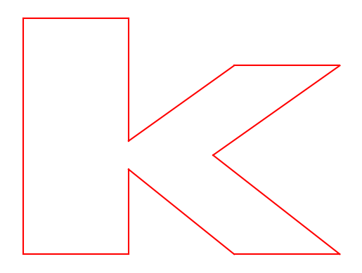
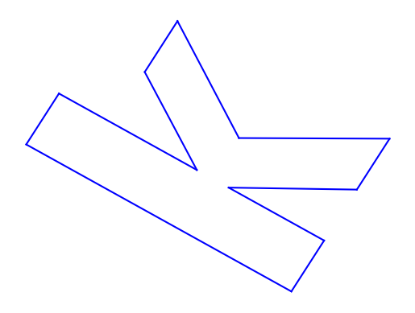
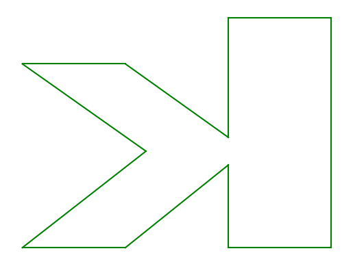
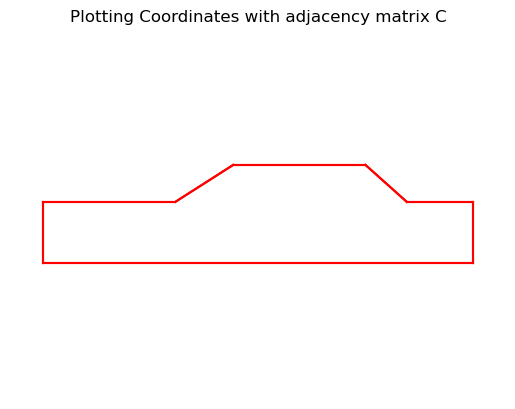
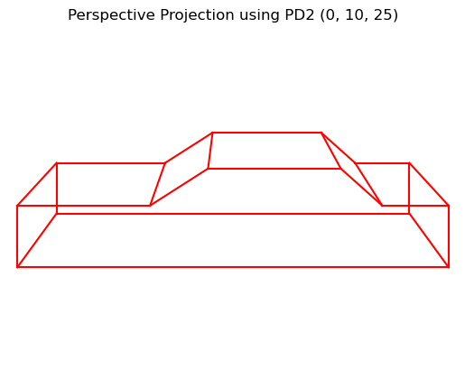
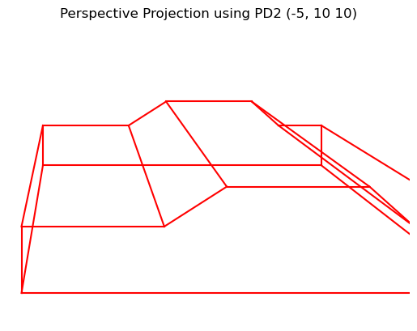
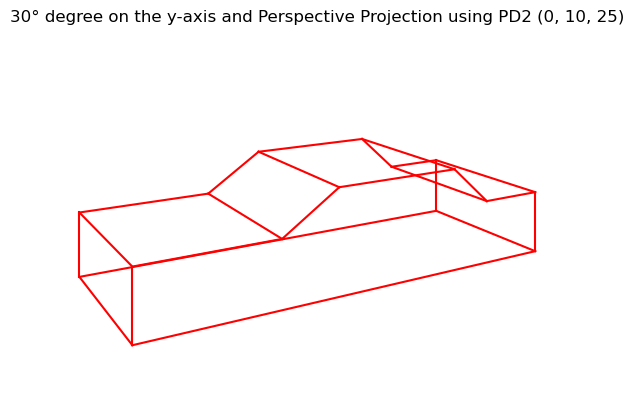
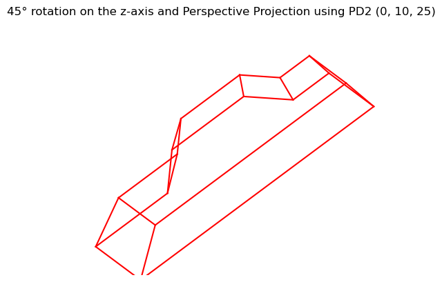
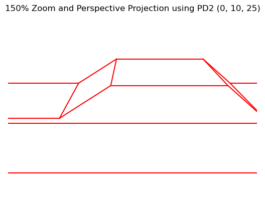

# A Journey into Automotive Design with Computer Graphics

Computer graphics have revolutionized the automotive industry, enabling designers and engineers to visualize, iterate, and refine vehicles with unprecedented speed and accuracy. From initial sketches to virtual showrooms, computer-aided design (CAD) and rendering have become indispensable tools. In this blog post, we'll embark on a journey through two projects that showcase the fundamental principles of computer graphics, starting with 2D transformations and culminating in a 3D case study of a classic 1983 Toyota Corolla.

## Project 1: The Building Blocks - 2D Transformations

Before diving into complex 3D models, it's essential to grasp the fundamentals of 2D graphics. This project focuses on defining, drawing, and manipulating a simple 2D object—the lowercase letter 'k'.

### The Letter 'k'

The first step is to define the shape of our object. We can represent the letter 'k' as a set of vertices (points) and an adjacency matrix that describes how these vertices are connected to form edges.

Here's how we can define the vertices in Python using `numpy`:

```python
import numpy as np

# The vertices of the letter 'k'
k = np.array([[0, 5, 5, 10, 15, 9, 15, 10, 5, 5, 0],
              [0, 0, 9, 0, 0, 10.5, 20, 20, 12, 25, 25]])
```

And the adjacency matrix, which tells us which vertices to connect. The adjacency matrix, also known as the connection matrix, is a square matrix used to represent a finite graph. The elements of the matrix indicate whether pairs of vertices are adjacent or not in the graph.

```python
# Adjacency matrix for the letter 'k'
adj = np.array([[0, 1, 0, 0, 0, 0, 0, 0, 0, 0, 1],
                [1, 0, 1, 0, 0, 0, 0, 0, 0, 0, 0],
                [0, 1, 0, 1, 0, 0, 0, 0, 0, 0, 0],
                [0, 0, 1, 0, 1, 0, 0, 0, 0, 0, 0],
                [0, 0, 0, 1, 0, 1, 0, 0, 0, 0, 0],
                [0, 0, 0, 0, 1, 0, 1, 0, 0, 0, 0],
                [0, 0, 0, 0, 0, 1, 0, 1, 0, 0, 0],
                [0, 0, 0, 0, 0, 0, 1, 0, 1, 0, 0],
                [0, 0, 0, 0, 0, 0, 0, 1, 0, 1, 0],
                [0, 0, 0, 0, 0, 0, 0, 0, 1, 0, 1],
                [1, 0, 0, 0, 0, 0, 0, 0, 0, 1, 0]])
```

Using `matplotlib`, we can then render the letter:



### Transformations in Action

The real power of computer graphics lies in the ability to manipulate objects. We can apply various transformations to our letter 'k' using matrix multiplication.

#### Rotation

To rotate the letter 45 degrees counter-clockwise, we use a rotation matrix:



#### Reflection

To create a mirror image of the letter, we use a reflection matrix:



### Key Takeaways

This first project provides a solid foundation in 2D computer graphics. We've seen how to represent objects using vertices and adjacency matrices and how to apply transformations using matrix multiplication. These fundamental concepts are the building blocks for the more complex 3D graphics we'll explore next.

## Project 2: Bringing a Car to Life - 3D Automotive Design

Now, let's move into the third dimension with a case study of a 1983 Toyota Corolla. This project demonstrates how the principles of 2D graphics can be extended to create and manipulate 3D objects.

### From 3D to 2D: The Magic of Perspective Projection

Our screens are 2D, so to view a 3D object, we need to project it onto a 2D plane. This is where perspective projection comes in. It creates the illusion of depth by making objects that are farther away appear smaller. This is achieved by defining a center of projection (the viewer's eye) and a viewing plane. The 3D object is then projected onto the viewing plane.

Here is the wireframe model of the Toyota Corolla, plotted using its coordinates and adjacency matrix:



Here is the car with a perspective projection applied:





### Homogeneous Coordinates

To simplify the mathematics of 3D transformations, we use homogeneous coordinates. By adding a fourth dimension to our 3D vertices, we can represent translations, rotations, and scaling as single matrix multiplications. This is a standard technique in computer graphics to streamline calculations.

### 3D Transformations

Now, let's apply some transformations to our 3D car model.

#### Rotation

We can rotate the car around different axes. Here's a 30° rotation about the y-axis, with a perspective projection applied:



And a 45° rotation about the z-axis, with a perspective projection applied:



#### Zooming

We can also zoom in on the car by applying a scaling transformation. Here is a 150% zoom with a perspective projection applied:



### The Power of Matrices

All of these transformations are achieved using transformation matrices. For example, the zoom effect is created with a scaling matrix:

```
[[1.5, 0, 0, 0],
 [0, 1.5, 0, 0],
 [0, 0, 1.5, 0],
 [0, 0, 0, 1]]
```

### Key Takeaways

This project provides a glimpse into the world of 3D automotive design. We've seen how to represent a 3D object, project it onto a 2D screen, and apply various transformations. These techniques are fundamental to modern CAD software and are used every day by automotive designers.

## Conclusion

Our journey from a simple 2D letter to a 3D car model has demonstrated the power and elegance of computer graphics. The principles of vertices, matrices, and transformations are the foundation upon which the stunningly realistic graphics we see in movies, games, and, of course, automotive design are built. These fundamental techniques are the cornerstone of modern automotive design, allowing for rapid prototyping and visualization of complex vehicles.

While our wireframe car is a great start, the next steps in a real-world automotive design process would involve adding color, shading, lighting, and textures to create a photorealistic rendering. These advanced techniques build upon the fundamental concepts we've explored here, further highlighting the crucial role of computer graphics in shaping the future of the automotive industry.
